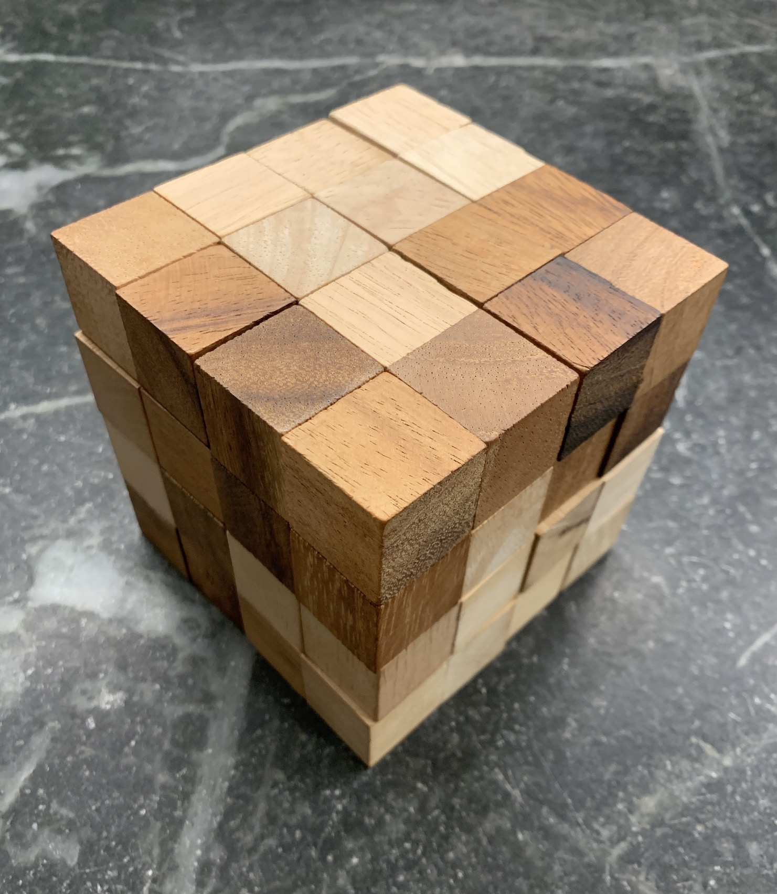
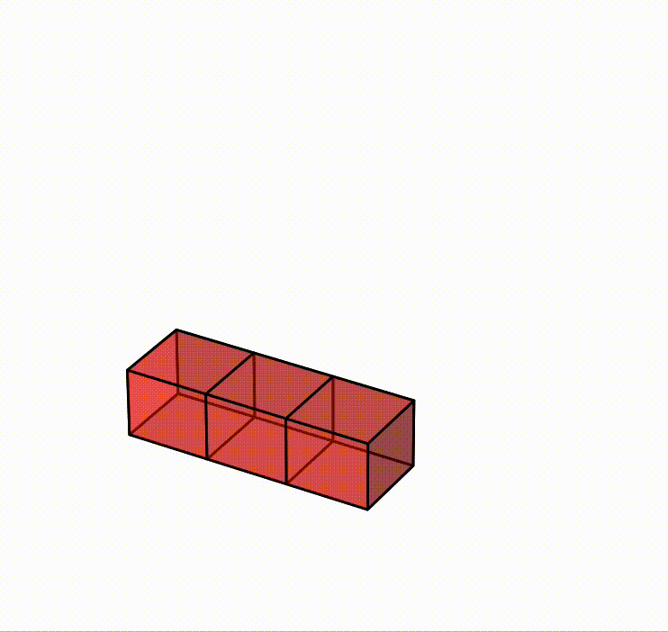

# Solving the 4x4x4 Snake Cube with Brute Force

The general idea is that at every angled piece there are 4 possible rotations, so try every one of them in a depth first search until it finds the solution. Early exits when a piece collides with an existing one or the bounding box exceeds 4x4x4.

I wrote it in C++ because I wasn't sure if I'd need to squeeze out performance (with 45 joints there are 4^45 possible configurations). It turns out most invalid states are pruned off early and it runs in <1s on my laptop, so in hindsight I wouldn't use C++ because the code could have been prettier in a different language.

I didn't originally intend for this code to be made public, so don't consider it to be a great example of my cleanest code :)

Here's the output of `make render`:

